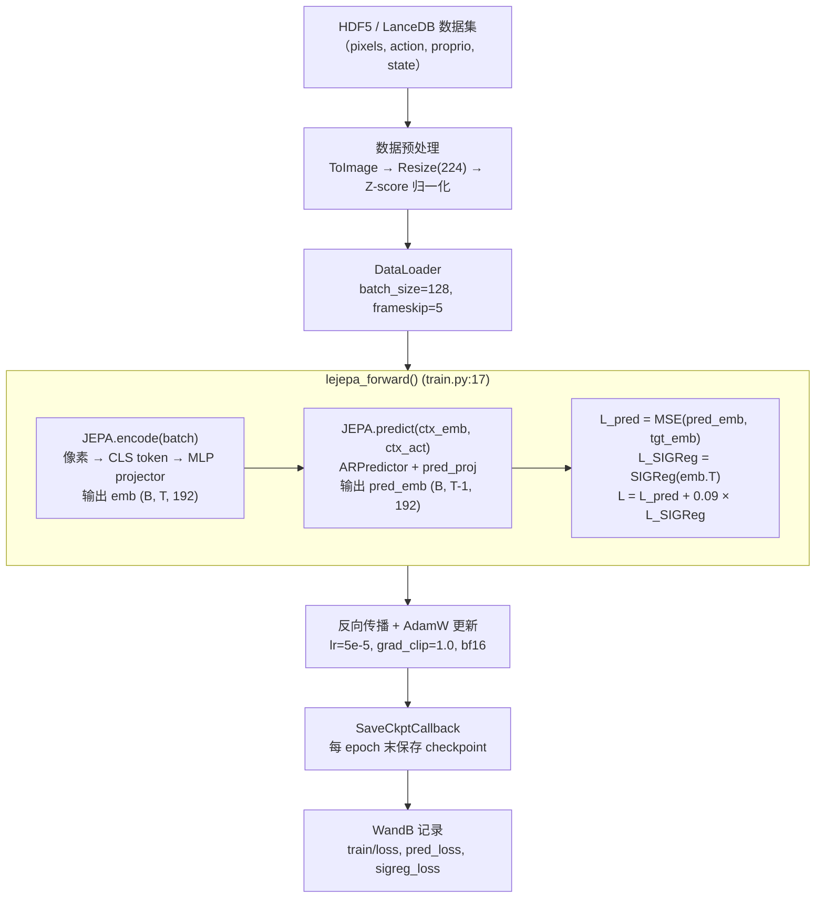
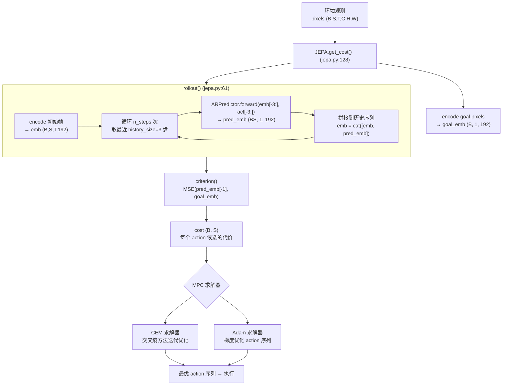
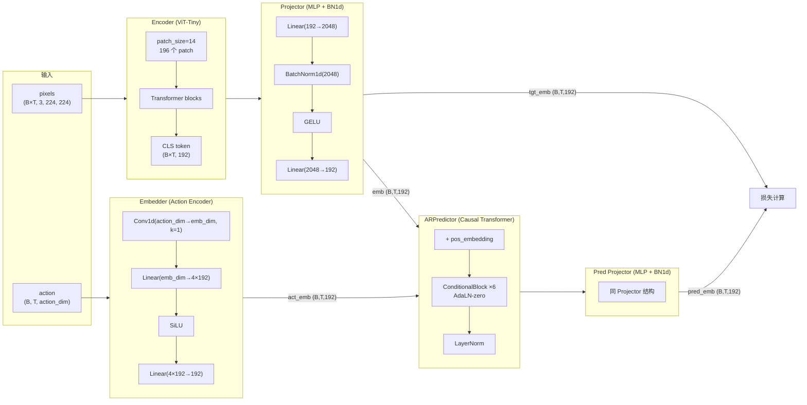
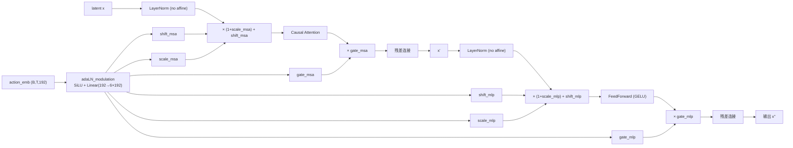
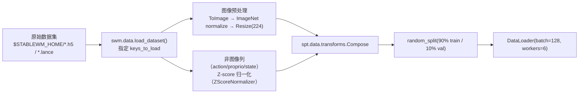

# LeWorldModel (LeWM) 项目深度解析

> 本文档对 LeWM 的核心思路、模型架构、算法原理、训练流程及产物进行全面梳理，面向希望理解或二次开发本项目的研究者与工程师。

---

## 目录

1. [核心思路与研究背景](#1-核心思路与研究背景)
2. [项目整体流程图](#2-项目整体流程图)
3. [模型架构解析](#3-模型架构解析)
4. [算法深度解析](#4-算法深度解析)
5. [训练步骤详解](#5-训练步骤详解)
6. [推理与规划流程](#6-推理与规划流程)
7. [训练产物](#7-训练产物)

---

## 1. 核心思路与研究背景

### 1.1 问题背景

Joint-Embedding Predictive Architecture（JEPA）是一类在压缩隐空间（latent space）中学习世界模型的框架：模型学会"预测未来状态的表示"，而非直接重建像素。这让模型能专注于语义结构，而非噪声细节。

然而，**现有 JEPA 方法存在严重的训练不稳定问题**——如果不加干预，编码器会把所有输入映射到同一个点（表示崩塌，representation collapse）。为此，已有方法引入了大量复杂组件：

| 已有方法 | 防崩塌机制 | 可调超参数 |
|---|---|---|
| I-JEPA / V-JEPA | EMA 目标网络 + Masking | ~6 个 |
| DINO-WM | 预训练 DINO 编码器（冻结）| — |
| PLDM | 对比损失 + stop-gradient | ~6 个 |
| **LeWM（本工作）** | **SIGReg 单一正则项** | **1 个（λ=0.09）** |

### 1.2 核心创新：两项损失即可稳定训练

LeWM 的核心贡献是证明：只需以下两项损失，即可从**原始像素端到端稳定**训练出高质量世界模型：

```
L = L_pred + λ · L_SIGReg
```

- **`L_pred`**：预测损失，MSE between predicted latent and target latent（下一帧）
- **`L_SIGReg`**：Sketch Isotropic Gaussian Regularizer，强制 latent 空间服从各向同性标准高斯分布，从根本上消除崩塌

这一设计将可调超参数从 6 个降至 **1 个**（λ），模型约 **15M 参数**，单卡数小时可训，规划速度比基于大模型的世界模型快 **48×**。

---

## 2. 项目整体流程图

### 2.1 训练流程



### 2.2 推理/规划流程



---

## 3. 模型架构解析

### 3.1 整体数据流



### 3.2 ConditionalBlock：AdaLN-zero 机制

AdaLN-zero 是从扩散模型（DiT）借鉴的条件调制机制，用 action embedding 动态控制每个 Transformer block 的归一化参数。

```python
# module.py:ConditionalBlock.forward()
shift_msa, scale_msa, gate_msa, shift_mlp, scale_mlp, gate_mlp = \
    self.adaLN_modulation(c).chunk(6, dim=-1)   # c = action_emb

# 调制公式（modulate）：x * (1 + scale) + shift
x = x + gate_msa * self.attn(modulate(norm1(x), shift_msa, scale_msa))
x = x + gate_mlp * self.mlp(modulate(norm2(x), shift_mlp, scale_mlp))
```

**关键设计**：`adaLN_modulation` 最后一层初始化为全零（`nn.init.constant_(..., 0)`），使训练开始时所有调制输出为 0，等价于标准 Transformer，保证训练稳定性。



---

## 4. 算法深度解析

### 4.1 SIGReg：Sketch Isotropic Gaussian Regularizer

**目标**：让嵌入分布 $p(z)$ 逼近标准各向同性高斯 $\mathcal{N}(0, I)$。

**原理**：利用特征函数（characteristic function）的唯一性。对于标准高斯，其特征函数为：

$$\varphi(t) = \mathbb{E}[e^{itz}] = e^{-t^2/2}$$

即 $\mathbb{E}[\cos(tz)] = e^{-t^2/2}$，$\mathbb{E}[\sin(tz)] = 0$。

SIGReg 通过随机投影将高维嵌入投影到一维，再用 **Epps-Pulley 统计量**衡量经验特征函数与高斯特征函数的偏差：

```python
# module.py:SIGReg.forward()  (行 25-36)
A = randn(D, num_proj); A /= A.norm(dim=0)    # 随机单位向量 (D, 1024)
x_t = (proj @ A).unsqueeze(-1) * self.t       # 投影后乘以采样点 t (T, B, 1024, 17)

# Epps-Pulley 统计量：实部误差² + 虚部误差²
err = (cos(x_t).mean(-3) - phi)**2 + sin(x_t).mean(-3)**2
#      ↑ 经验余弦均值          ↑ 高斯特征函数    ↑ 经验正弦均值（应为0）

statistic = (err @ weights) * B    # 对 t 积分（梯形法则）
return statistic.mean()            # 对投影和时间步平均
```

其中 `phi = exp(-t²/2)`（高斯特征函数），`weights` 是梯形积分权重，`t` 在 `[0, 3]` 取 17 个等间距节点。

**与其他方法对比**：

| 方法 | 机制 | 是否需要负样本 | 是否需要 stop-gradient |
|---|---|---|---|
| BarlowTwins | 特征去相关 | 否 | 是 |
| VICReg | 方差+协方差正则 | 否 | 是 |
| MoCo / SimCLR | 对比损失 | 是 | 是（MoCo） |
| **SIGReg** | **高斯特征函数逼近** | **否** | **否** |

SIGReg 不需要负样本对，不需要 stop-gradient，单 GPU 可高效计算，是本工作能够彻底去掉 EMA 目标网络的关键。

### 4.2 ARPredictor：自回归滑动窗口预测

**训练时**（单步预测）：

```
输入：ctx_emb (B, history_size=3, 192)
       ctx_act (B, history_size=3, 192)
输出：pred_emb (B, history_size=3, 192)  ← 取最后一个时间步作为预测
```

模型在训练时将 `ctx_len=history_size` 步的历史输入 Transformer，因果 attention mask 保证每个时间步只能看到自身及之前的信息，整个序列并行计算。

**推理时**（多步 rollout，`jepa.py:rollout`）：

```python
for t in range(n_steps):
    emb_trunc = emb[:, -HS:]          # 取最近 3 步
    act_trunc = act_emb[:, -HS:]
    pred_emb  = predict(emb_trunc, act_trunc)[:, -1:]  # 只用最后一步预测
    emb = cat([emb, pred_emb], dim=1)  # 追加到历史
```

滑动窗口长度固定为 `history_size=3`，避免随时间增长导致的计算量增加与分布外推问题。

---

## 5. 训练步骤详解

### 5.1 数据准备



- **frameskip**（pusht=5）：每隔 5 帧取一步，扩大有效动作维度为 `frameskip × action_dim`
- **num_steps = history_size + num_preds**（默认 3+1=4）：每条样本包含 4 个连续时间步
- NaN 值（序列边界处出现）在 `lejepa_forward` 中用 `nan_to_num(0.0)` 填充

### 5.2 训练配置

| 参数 | 值 | 配置文件 |
|---|---|---|
| max_epochs | 100 | `lewm.yaml` |
| batch_size | 128 | `lewm.yaml` |
| precision | bf16 | `lewm.yaml` |
| optimizer | AdamW | `lewm.yaml` |
| lr | 5e-5 | `lewm.yaml` |
| weight_decay | 1e-3 | `lewm.yaml` |
| scheduler | LinearWarmup + CosineAnnealing | `train.py:87` |
| gradient_clip_val | 1.0 | `lewm.yaml` |
| λ (SIGReg weight) | 0.09 | `lewm.yaml` |

### 5.3 前向传播逐步拆解

```python
# train.py:lejepa_forward()  (行 17-45)

# Step 1: 填充 NaN（序列边界）
batch["action"] = torch.nan_to_num(batch["action"], 0.0)

# Step 2: 编码所有时间步
output = self.model.encode(batch)
# 内部：pixels(B,T,C,H,W) → flatten → ViT → CLS token → projector → emb(B,T,192)
#       action(B,T,D) → Embedder(Conv1d+MLP) → act_emb(B,T,192)

emb     = output["emb"]      # (B, 4, 192)
act_emb = output["act_emb"]  # (B, 4, 192)

# Step 3: 切分上下文与目标
ctx_emb = emb[:, :ctx_len]   # (B, 3, 192)  ← 前 history_size 步
ctx_act = act_emb[:, :ctx_len]
tgt_emb = emb[:, n_preds:]   # (B, 3, 192)  ← 向后偏移 num_preds 步

# Step 4: 预测
pred_emb = self.model.predict(ctx_emb, ctx_act)
# 内部：ARPredictor(ctx_emb + pos_emb, ctx_act) → pred_proj → (B, 3, 192)

# Step 5: 损失
pred_loss   = (pred_emb - tgt_emb).pow(2).mean()
sigreg_loss = self.sigreg(emb.transpose(0, 1))   # 输入 (T, B, 192)
loss        = pred_loss + 0.09 * sigreg_loss
```

**注意**：`ctx_emb` 的每个时间步 $t$ 对应目标 `tgt_emb` 的时间步 $t + \text{num\_preds}$，即模型被训练为预测 `num_preds`（默认1）步之后的状态。

### 5.4 Checkpoint 保存策略

`utils.py:SaveCkptCallback` 在每个 epoch 末（仅 global rank 0）调用 `swm.wm.utils.save_pretrained`：

```
$STABLEWM_HOME/checkpoints/<job_id>/
├── config.yaml                    ← 完整 Hydra 配置（train.py:117）
├── lewm_object.ckpt               ← torch.save(model)，可直接 load 使用
└── weights_epoch_{N}.pt           ← model.state_dict()，轻量权重文件
```

---

## 6. 推理与规划流程

### 6.1 rollout() 自回归展开

```python
# jepa.py:rollout()  (行 61-110)
def rollout(self, info, action_sequence, history_size=3):
    # action_sequence: (B, S, T, action_dim)
    # S = 候选动作序列数量，T = 总时间步 = H（历史）+ n_steps（预测）

    # 1. 编码初始帧
    _init = encode(info[:, 0])                          # 取第 0 个候选的初始帧
    emb   = _init["emb"].unsqueeze(1).expand(B, S, -1, -1)  # (B,S,H,192)

    # 2. 展开为 (B×S, H, 192) 进行批量 rollout
    emb      = rearrange(emb, "b s ... -> (b s) ...")
    act      = rearrange(act_0, "b s ... -> (b s) ...")       # 历史动作
    act_future = rearrange(act_future, "b s ... -> (b s) ...")  # 未来动作

    # 3. 自回归循环
    for t in range(n_steps):
        act_emb  = action_encoder(act)
        pred_emb = predict(emb[:, -HS:], act_emb[:, -HS:])[:, -1:]  # (B×S, 1, 192)
        emb      = cat([emb, pred_emb], dim=1)
        act      = cat([act, act_future[:, t:t+1]], dim=1)

    # 4. 恢复形状 → (B, S, T_total, 192)
    pred_rollout = rearrange(emb, "(b s) ... -> b s ...", b=B, s=S)
```

### 6.2 get_cost() MPC 入口

```python
# jepa.py:get_cost()  (行 128-153)
def get_cost(self, info_dict, action_candidates):
    # action_candidates: (B, S, T, action_dim)  S 个候选序列

    goal = encode(info_dict["goal"])           # 编码目标帧 → goal_emb (B,1,192)
    info_dict = rollout(info_dict, action_candidates)  # 自回归预测

    # criterion: MSE between 最终预测嵌入 和 goal_emb
    cost = MSE(pred_emb[..., -1:, :], goal_emb[..., -1:, :])  # (B, S)
    return cost
```

### 6.3 MPC 求解器

eval 配置中支持两种求解器（`config/eval/solver/`）：

| 求解器 | 原理 | 适用场景 |
|---|---|---|
| **CEM**（交叉熵方法） | 迭代采样 → 取 top-k → 更新高斯分布 | 默认，无需梯度，稳健 |
| **Adam**（梯度优化） | 对 action 序列直接反向传播 | 需要可微规划，精度更高 |

---

## 7. 训练产物

### 7.1 文件结构

```
$STABLEWM_HOME/                         # 默认 ~/.stable-wm/
├── pusht_expert_train.h5               # 训练数据集
├── pusht_expert_train.lance/           # LanceDB 格式（可选）
└── checkpoints/
    └── <hydra_job_id>/                 # 每次训练的唯一 job id
        ├── config.yaml                 # 完整训练配置（可复现）
        ├── lewm_object.ckpt            # 完整 Python 对象（推理用）
        ├── weights_epoch_1.pt          # epoch 1 权重（state dict）
        ├── weights_epoch_50.pt
        └── weights_epoch_100.pt        # 最终权重
```

### 7.2 Checkpoint 格式对比

| 文件 | 内容 | 用途 |
|---|---|---|
| `*_object.ckpt` | `torch.save(model)`，完整 Python 对象 | `swm.policy.AutoCostModel` 直接加载；eval.py 使用 |
| `weights_epoch_N.pt` | `model.state_dict()`，纯权重 | 手动加载到自定义模型实例；HuggingFace 发布格式 |

### 7.3 WandB 记录指标

训练过程中每个 step 同步记录（`train.py:44`）：

| 指标 | 含义 |
|---|---|
| `train/loss` | 总损失 = pred_loss + 0.09 × sigreg_loss |
| `train/pred_loss` | 预测 MSE，反映模型预测准确性 |
| `train/sigreg_loss` | 高斯正则损失，反映 latent 分布质量 |
| `val/loss` / `val/pred_loss` / `val/sigreg_loss` | 验证集对应指标 |

### 7.4 评估结果

`eval.py` 将规划结果追加写入文本文件（`config/eval/*.yaml` 中 `output.filename` 指定）：

```
$STABLEWM_HOME/pusht/pusht_results.txt

==== CONFIG ====
<完整 Hydra yaml 配置>

==== RESULTS ====
metrics: {'success_rate': 0.82, ...}
evaluation_time: 143.2 seconds
```
